# Emozzk Lite 사용 설명서

Emozzk Lite는 CHZZK 기본 이모티콘 패널을 키보드 단축키와 즐겨찾기 기능으로 더 빠르게 조작할 수 있게 해주는 Chromium 계열 브라우저 확장 프로그램입니다.

이 확장 프로그램은 CHZZK 또는 NAVER의 공식 도구가 아닙니다. 채팅 메시지 payload, WebSocket 전송 데이터, 구독 권한을 직접 수정하지 않습니다.

사용자가 실제로 클릭할 수 있는 CHZZK 이모티콘 버튼을 더 편하게 누르는 방식으로 동작합니다.

## 1. 시작하기

채팅 입력 중이 아닐 때 `E` 키로 이모티콘 패널을 열 수 있습니다.

`Esc` 키로 이모티콘 패널을 닫을 수 있습니다.

<p>
  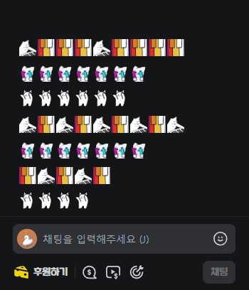
</p>

---

## 2. 즐겨찾기에 이모티콘 추가하기

`최근 사용한 이모티콘` 영역에서 이모티콘을 `Alt + 좌클릭`하면 즐겨찾기에 추가할 수 있습니다.

즐겨찾기에 추가된 이모티콘은 패널 상단에 따로 표시되어 더 빠르게 선택할 수 있습니다.

<p>
  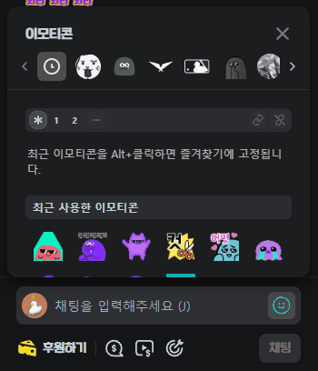
</p>

---

## 3. 단축키 세트 전환

패널 상단의 세트 버튼을 클릭하면 사용할 단축키 세트를 전환할 수 있습니다.

세트 버튼을 좌우로 드래그해도 이전 세트 또는 다음 세트로 전환할 수 있습니다.

선택한 세트에 따라 등록된 단축키와 세트별 이모티콘 순서가 함께 적용됩니다.

<p>
  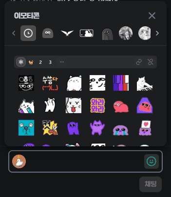
</p>

---

## 4. 이모티콘 단축키 등록

<span class="doc-icon doc-icon-link" role="img" aria-label="단축키 지정"></span> 버튼을 눌러 단축키 지정 모드로 들어갑니다.

등록할 이모티콘을 선택한 뒤 원하는 키를 누르고, <span class="doc-icon doc-icon-save" role="img" aria-label="저장"></span> 버튼을 눌러 저장합니다.

등록된 단축키는 이모티콘 위에 작은 배지로 표시됩니다.

조합 키는 단독으로 사용할 수 없습니다.

일부 키(`Esc`,`Win`등) 는 지정할 수 없습니다.

<p>
  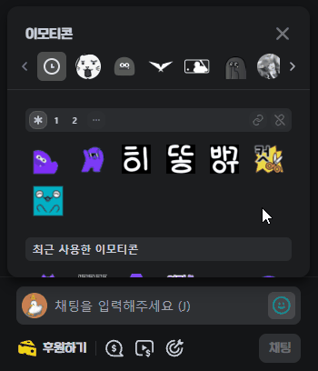
</p>

---

## 5. 이모티콘 단축키 해제

<span class="doc-icon doc-icon-unlink" role="img" aria-label="단축키 해제"></span> 버튼을 눌러 단축키 해제 모드로 들어갑니다.

해제할 이모티콘을 선택한 뒤 <span class="doc-icon doc-icon-save" role="img" aria-label="저장"></span> 버튼을 누르면 선택한 단축키가 해제됩니다.

여러 이모티콘을 한 번에 선택해서 해제할 수 있습니다.

<p>
  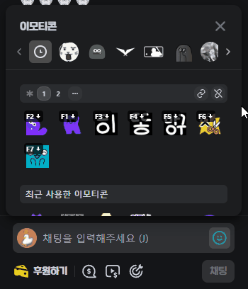
</p>

---

## 6. 즐겨찾기에서 이모티콘 제거

즐겨찾기에 등록된 이모티콘을 `Alt + 좌클릭`하면 즐겨찾기에서 제거할 수 있습니다.

단축키가 지정된 이모티콘은 바로 제거되지 않습니다.

제거를 시도하면 단축키가 지정된 세트가 깜빡이며 강조됩니다.

먼저 해당 단축키를 해제한 뒤 즐겨찾기에서 제거할 수 있습니다.

<p>
  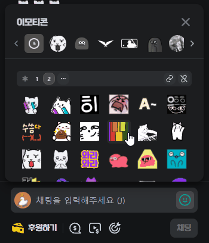
</p>

---

## 7. 이모티콘 순서 변경

즐겨찾기에 등록된 이모티콘은 드래그해서 순서를 변경할 수 있습니다.

<p>
  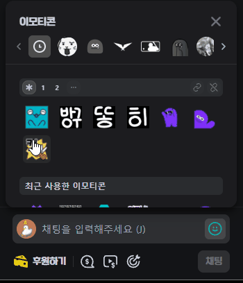
</p>

---

## 8. 세트별 순서 변경

세트 화면에서는 이모티콘을 드래그해서 세트별 이모티콘 순서를 변경할 수 있습니다.

세트 화면에서 변경한 순서는 현재 세트에서만 적용됩니다.

<span class="doc-icon doc-icon-context" role="img" aria-label="컨텍스트 메뉴"></span> 컨텍스트 메뉴에서 `기본 정렬 적용` 버튼을 누르면 <span class="doc-icon doc-icon-main" role="img" aria-label="즐겨찾기 모아보기"></span> 즐겨찾기 모아보기 순서로 초기화할 수 있습니다.

<p>
  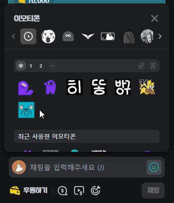
</p>

---

## 9. 세트 이름 변경

컨텍스트 메뉴에서 `세트 이름 변경` 버튼을 누르면 단축키 세트의 이름을 변경할 수 있습니다.

세트명에는 Windows 이모지 입력기(`Win + .`)로 입력한 이모지도 사용할 수 있습니다.

세트 아이콘은 세트명의 첫 글자를 기준으로 표시됩니다.

```txt
스트리머 → ㅅ
🐈고양이 → 🐈
Streamer → S
```

<p>
  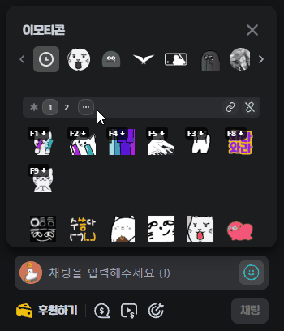
</p>

---

## 10. 확장 프로그램 팝업 설정

브라우저 우측 상단의 확장 프로그램 아이콘을 누르면 Emozzk Lite 설정 화면을 열 수 있습니다.

최근 이모티콘 보존 개수, 단축키 세트 수, 실험실 옵션(`KeyUp`, `KeyDown` 허용)을 변경할 수 있습니다.

최근 이모티콘 보존 개수는 기본 60개입니다.

팝업에서 `20`, `40`, `60`, `100`, `150`, `200`개 중 하나로 변경할 수 있습니다.

즐겨찾기에 추가된 이모티콘은 최근 이모티콘 정리 과정에서 우선 보존됩니다.

단축키 세트는 기본 2개이며, 팝업에서 1개부터 9개까지 조절할 수 있습니다.

<p>
  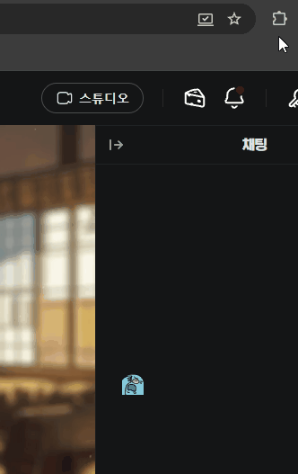
</p>

---

## 11. 실험실 옵션

실험실 옵션(`KeyUp`, `KeyDown`)을 켜면 단축키 동작 시점을 `키를 누를 때(기본값)`, `키를 뗄 때`, `키를 누르거나 뗄 때` 중에서 지정할 수 있습니다.

<p>
  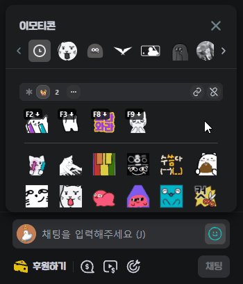
</p>

---

## 12. 실사용 예시

즐겨찾기와 단축키를 함께 사용하면 자주 쓰는 이모티콘을 더 빠르게 선택할 수 있습니다.

일반 입력 중에는 의도치 않은 단축키 동작을 줄이도록 처리됩니다.

<p>
  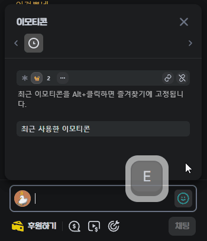
</p>

---

## 단축키로 사용할 수 있는 키

단축키는 실제 키보드 위치를 기준으로 저장됩니다.

주로 사용할 수 있는 키는 다음과 같습니다.

- `F1` ~ `F12`
- `A` ~ `Z`
- `0` ~ `9`
- 방향키
- `Backspace`, `Delete`, `Home`, `End`, `PageUp`, `PageDown`
- `Ctrl`, `Alt`, `Shift` 조합 단축키 (단독으로는 사용할 수 없습니다)

다음 키는 단축키로 등록하지 않습니다.

- `Space`
- `Escape`
- `Tab`
- `Enter`
- `CapsLock`
- 한글 입력 중 발생하는 단일 한글 키
- IME 조합 중 발생한 키 입력

일부 브라우저 예약 단축키는 브라우저가 우선 처리할 수 있습니다.

---

## 참고

- 즐겨찾기, 단축키, 최근 이모티콘 설정은 브라우저 로컬 저장소에 저장됩니다.
- Emozzk Lite는 CHZZK 메시지 전송 데이터나 WebSocket 데이터를 직접 수정하지 않습니다.
- 채팅 입력창에 이미 이모티콘이 10개 들어간 경우에는 추가 이모티콘 입력을 시도하지 않습니다.
- 즐겨찾기, 단축키, 최근 이모티콘 설정은 브라우저 로컬 저장소에 저장됩니다.
- Emozzk Lite는 설정 저장을 위해 `storage` 권한을 사용하고, CHZZK 페이지에서 동작하기 위해 `https://chzzk.naver.com/*` 권한을 사용합니다.

[개인정보 처리방침 보기](./privacy.html)